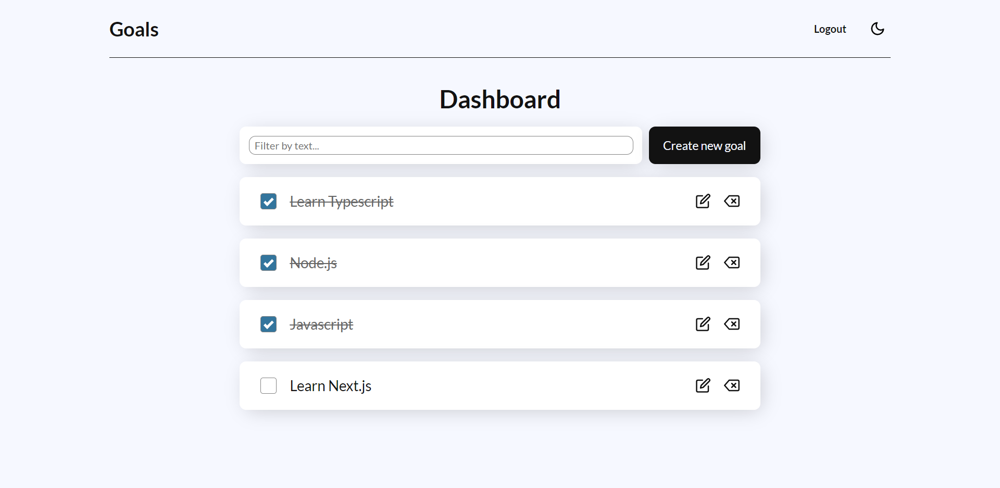
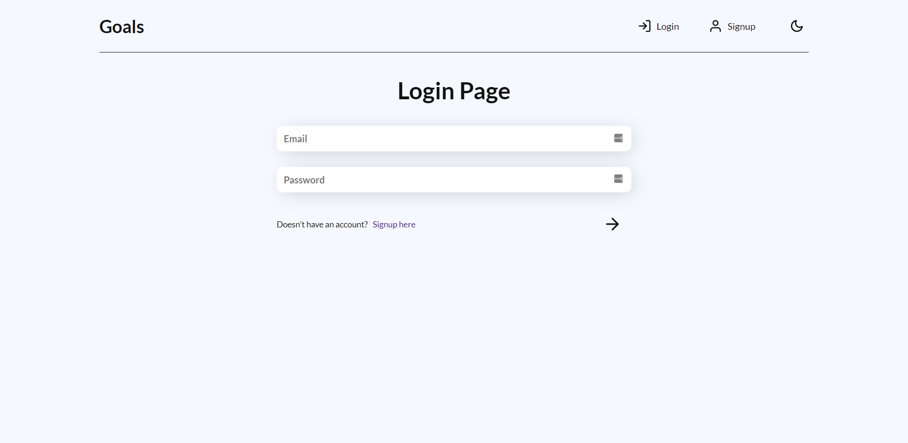
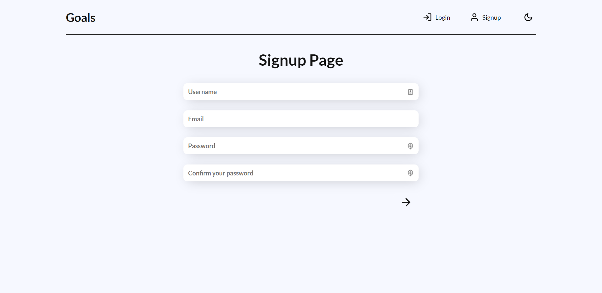
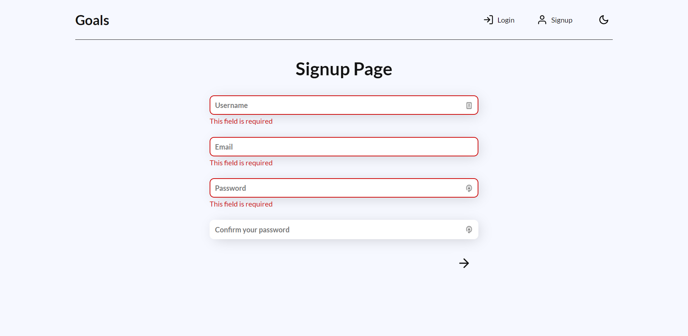

# Goals App

This application is a CRUD-based app with login/signup functionality where you can set and track all of your goals in a very simple and user-friendly interface.

Access the application here:
[Application link](https://whoiscaio-goals-app.herokuapp.com/)

## Screenshots

### Dashboard

### Login page

### Signup page

### Form errors

### Create/Update goal modal

## Stack

**Front-end:** React, Typescript, Styled-components, Redux, Redux Toolkit.

**Back-end:** Node.js, Express, Mongoose, Bcrypt, jsonwebtoken (jwt).

**Database:** MongoDB.

## Author

- Github: [@whoiscaio](https://www.github.com/octokatherine)
- Linkedin: [Caio Lima](https://www.linkedin.com/in/lima-caio)

